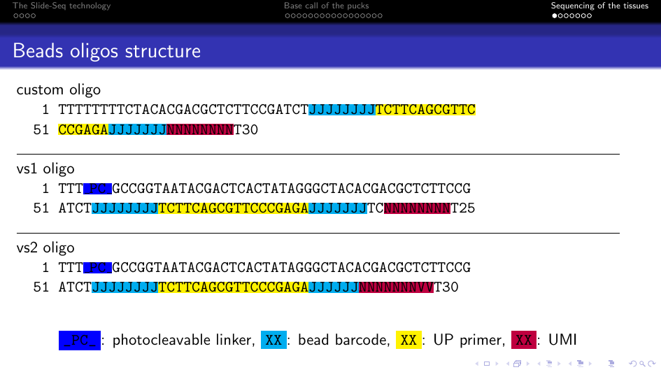

# Pipeline configuration

The pipeline requires two configuration files:

- a parameters `YAML` file (`params.yml`)
- a design information `CSV` file (`design.csv`)

## The parameters `YAML` file

The `YAML` file contains the location of the `CSV` design file and the values of some parameters of the pipeline.
It should look like that:

```
design: test/design.csv
up_errors_threshold: 3
umis_threshold: 10
barcode_errors_threshold: 4
barcode_max_matches: 5
barcode_max_entropy: 0.5
```

Its entries are:

- `design`: the location of the design `CSV` file
- `up_errors_threshold`: the maximum number of mismatches in the UP primer sequence
- `umis_threshold`: the minimum number of UMIs for a bead barcode to be kept
- `barcode_errors_threshold`, `barcode_max_matches` and `barcode_max_entropy`: 3 parameters for the barcode matching. You should probably leave as they are. They probably will be useless in the future

## The design `CSV` file

The `CSV` file contains the information about the samples.
It should looks like that:

```
name,fastq_1,fastq_2,puck,read_structure,genome,gtf
sample_name,/path/to/read1/fastq,/path/to/read2/fastq,/path/to/coordinates/csv,read_structure_string,/path/to/STAR/index,/path/to/gtf
```

- `name`: the sample name
- `fastq_1` the path (relative or absolute) to the `FASTQ` file containing reads 1
- `fastq_2` the path (relative or absolute) to the `FASTQ` file containing reads 2
- `puck` the path (relative or absolute) to the `CSV` file containing the barcodes coordinates
- `read_structure` the read structure string
- `genome` the path (relative or absolute) to the `STAR` genome index
- `gtf`: the path (relative or absolute) to the `GTF` file

The `FASTQ` files with the same sample name will be merged.

For example, here the `CSV` file associated with the test dataset (`test/design.csv`):

```
name,fastq_1,fastq_2,puck,read_structure,genome,gtf
sample1,test/sample1_L001_R1.fastq.gz,test/sample1_L001_R2.fastq.gz,test/puck1.csv,8C18U7C2X8M,/camp/svc/reference/Genomics/babs/mus_musculus/ensembl/GRCm38/release-95/genome_idx/star/100bp,/camp/svc/reference/Genomics/babs/mus_musculus/
ensembl/GRCm38/release-95/gtf/Mus_musculus.GRCm38.95.gtf
sample1,test/sample1_L002_R1.fastq.gz,test/sample1_L002_R2.fastq.gz,test/puck1.csv,8C18U7C2X8M,/camp/svc/reference/Genomics/babs/mus_musculus/ensembl/GRCm38/release-95/genome_idx/star/100bp,/camp/svc/reference/Genomics/babs/mus_musculus/
ensembl/GRCm38/release-95/gtf/Mus_musculus.GRCm38.95.gtf
sample1,test/sample1_L003_R1.fastq.gz,test/sample1_L003_R2.fastq.gz,test/puck1.csv,8C18U7C2X8M,/camp/svc/reference/Genomics/babs/mus_musculus/ensembl/GRCm38/release-95/genome_idx/star/100bp,/camp/svc/reference/Genomics/babs/mus_musculus/
ensembl/GRCm38/release-95/gtf/Mus_musculus.GRCm38.95.gtf
sample1,test/sample1_L004_R1.fastq.gz,test/sample1_L004_R2.fastq.gz,test/puck1.csv,8C18U7C2X8M,/camp/svc/reference/Genomics/babs/mus_musculus/ensembl/GRCm38/release-95/genome_idx/star/100bp,/camp/svc/reference/Genomics/babs/mus_musculus/
ensembl/GRCm38/release-95/gtf/Mus_musculus.GRCm38.95.gtf
sample1,test/sample1_L005_R1.fastq.gz,test/sample1_L005_R2.fastq.gz,test/puck1.csv,8C18U7C2X8M,/camp/svc/reference/Genomics/babs/mus_musculus/ensembl/GRCm38/release-95/genome_idx/star/100bp,/camp/svc/reference/Genomics/babs/mus_musculus/
ensembl/GRCm38/release-95/gtf/Mus_musculus.GRCm38.95.gtf
sample2,test/sample2_L001_R1.fastq.gz,test/sample2_L001_R2.fastq.gz,test/puck2.csv,8C18U7C2X8M,/camp/svc/reference/Genomics/babs/mus_musculus/ensembl/GRCm38/release-95/genome_idx/star/100bp,/camp/svc/reference/Genomics/babs/mus_musculus/
ensembl/GRCm38/release-95/gtf/Mus_musculus.GRCm38.95.gtf
sample2,test/sample2_L002_R1.fastq.gz,test/sample2_L002_R2.fastq.gz,test/puck2.csv,8C18U7C2X8M,/camp/svc/reference/Genomics/babs/mus_musculus/ensembl/GRCm38/release-95/genome_idx/star/100bp,/camp/svc/reference/Genomics/babs/mus_musculus/
ensembl/GRCm38/release-95/gtf/Mus_musculus.GRCm38.95.gtf
sample2,test/sample2_L003_R1.fastq.gz,test/sample2_L003_R2.fastq.gz,test/puck2.csv,8C18U7C2X8M,/camp/svc/reference/Genomics/babs/mus_musculus/ensembl/GRCm38/release-95/genome_idx/star/100bp,/camp/svc/reference/Genomics/babs/mus_musculus/
ensembl/GRCm38/release-95/gtf/Mus_musculus.GRCm38.95.gtf
sample2,test/sample2_L004_R1.fastq.gz,test/sample2_L004_R2.fastq.gz,test/puck2.csv,8C18U7C2X8M,/camp/svc/reference/Genomics/babs/mus_musculus/ensembl/GRCm38/release-95/genome_idx/star/100bp,/camp/svc/reference/Genomics/babs/mus_musculus/
ensembl/GRCm38/release-95/gtf/Mus_musculus.GRCm38.95.gtf
sample2,test/sample2_L005_R1.fastq.gz,test/sample2_L005_R2.fastq.gz,test/puck2.csv,8C18U7C2X8M,/camp/svc/reference/Genomics/babs/mus_musculus/ensembl/GRCm38/release-95/genome_idx/star/100bp,/camp/svc/reference/Genomics/babs/mus_musculus/
ensembl/GRCm38/release-95/gtf/Mus_musculus.GRCm38.95.gtf
```

### About the sample names and `FASTQ` paths

The pipeline should be resilient to exotic samples names, file names and paths.
However, just be sure, and as a good practice, it might good to avoid spaces in file names, sample names and file paths.
It is also better not to start file names or sample names with a digit.

### About the read structure definition

We use a string to define the structure of read 1.
The read structure definition tells us where to find the bead barcode, UP primer and UMI on read 1.

Here are 3 common read structures that are used:



The associated read structure definitions are:

- custom oligo: `8C18U7C8M`
- vs1 oligo: `8C18U7C2X8M`
- vs2 olig: `8C18U6C9M`

The digits define the number of bases and the letters what the bases:

- `C`: bead barcode's base
- `U`: UP primer's base
- `M`: UMI's base
- `X`: base we want to remove

So, for example, `8C18U7C2X8M` means that we take the first 8 bases of read 1 for the bead barcode, then the 18 following bases are for the UP primer, after that we take 7 bases for the bead barcode and merge them with the first part of the barcode (the barcode is in two parts), then we throw 2 bases and finally take 8 bases for the UMI.
