# Pipeline output

The pipeline outputs are in the `results` directory.
For example, here we have two samples (`sample1` and `sample2`):

```
$ ls results 
files  qc  sample1.csv  sample1_dge  sample1.pdf  sample2.csv  sample2_dge  sample2.pdf
```

The `files` and `qc` directories contain intermediate files and raw QC metrics respectively.
So, they can be both deleted.

You are interested in the following files:

 * `sample1.pdf`: the QC plots
 * `sample1_dge`: the digital expression matrix
 * `sample1.csv`: the beads coordinates

## Digital matrix expression and bead coordinates


The `sample1.csv` file contains the barcodes coordinates and the `sample1_dge` contains the count matrix files.

```
$ tree results/sample1.csv results/sample1_dge
results/sample1.csv [error opening dir]
results/sample1_dge
├── barcodes.tsv.gz
├── features.tsv.gz
└── matrix.mtx.gz
```

We can import the count matrix and the coordinates in R this way:

```
library(Seurat)
library(dplyr)
library(readr)
library(tibble)

counts <- Seurat::Read10X("imran_puck_15_humangbm_dge")

df <-
	readr::read_csv("imran_puck_15_humangbm.csv") %>%
	dplyr::mutate(Barcode=paste0(Barcode, "-1")) %>%
	tibble::column_to_rownames("Barcode")

md = df[colnames(counts),]
obj <- Seurat::CreateSeuratObject(counts=counts, meta.data=md, assay="Spatial")
```

If you use python:

```
import panda as pd
import scanpy as sc

coords = pd\
	.read_csv("results/sample1.csv")\
	.rename(columns={"PuckBarcode": "Barcode"})\
	.set_index("SeqBarcode")

adata = sc.read_10x_mtx("results/sample1_dge")
adata.obs = coords.loc[ adata.obs.index ]
```

## QC metrics

### First step: checking for barcode length (page 1)

The first step is to throw away the read pairs whose read 1 is too short.
For example, if you have the following read structure `8C18U6C9M1X`, then you need at least 42 bp (or 41 bp if you remove the last base) in order to extract the UP primer and the UMI.
On the following picture, there are 68,647,673 reads in total and all of them are longer than 42 bp, so we keep all of them.

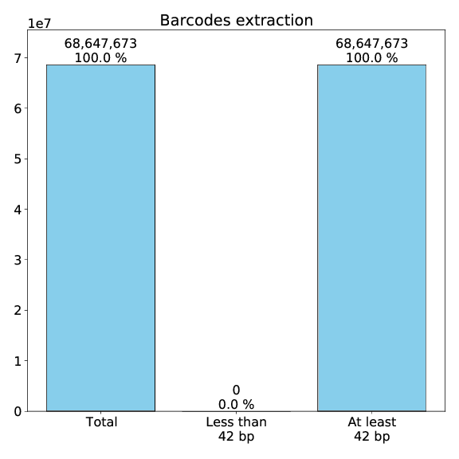

### Second step: matching UP primer (page 2)

The second step is to match the UP primer sequence on read 1 (among those that are long enough).
You can allow a certain tolerance in the matching by setting the maximum Hamming distance (usually 3 or 4).
On the following picture, there 52,055,737 reads that match the UP primer (among the 68,647,673 read pairs that are long enough).

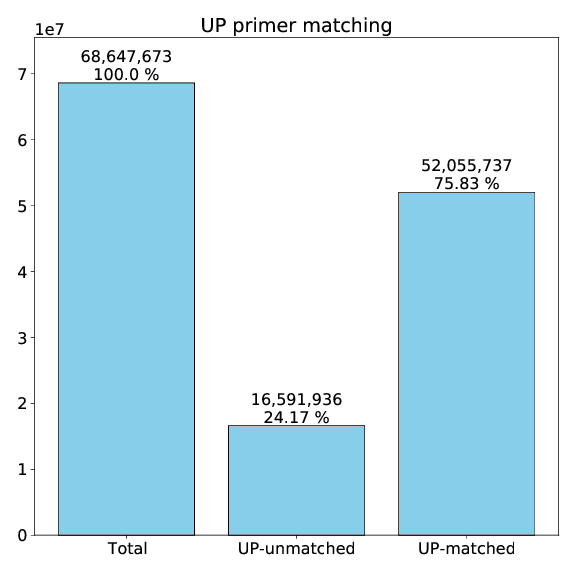

### Third step: mapping read 2 on the genome (page 3)

The third step is to map read 2 on the genome.
For example, here we can see that among the 52,055,737 reads pairs that match the UP primer 40,420,278 of them can be mapped on the genome.

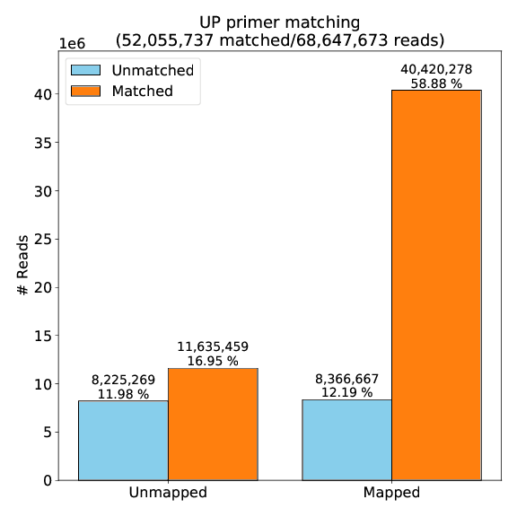

### Fourth step: filtering the barcodes with too few UMIs (page 4)

One might not be interested in bead with too few genes.
So, we can remove the beads with less than a given number of UMIs.
Here, we kept everything for example.

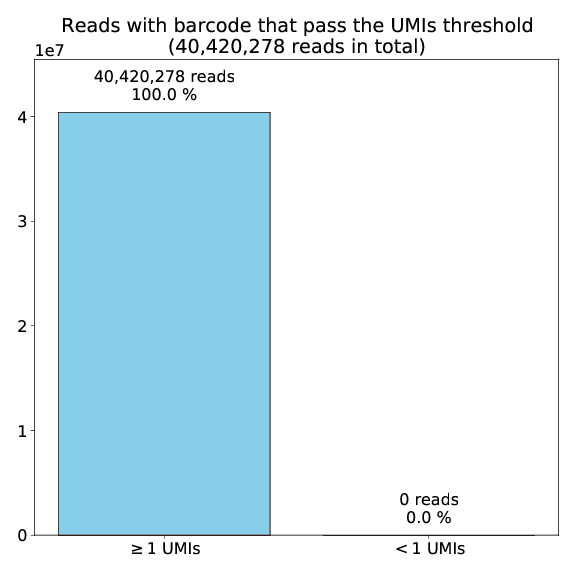

### Fifth step: barcode matching (pages 5, 13, 14, and 15)

The fifth step is to match the sequencing barcodes with the puck barcodes (among the reads pairs that match the UP primer and can be mapped on the genome).

Here (page 13) we can see that the sequencing data contained 2,572,149 bead barcodes and the puck contained 77,938 bead barcodes.
Among all the sequencing barcodes, we were able to associate 58,725 of them to a puck barcode.

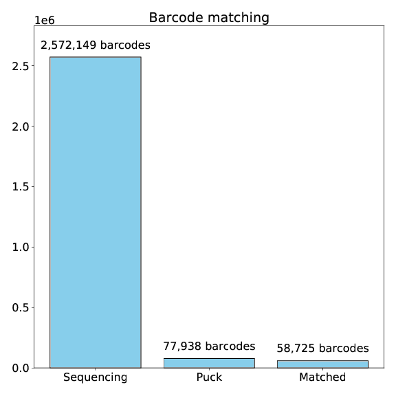
On the following picture (page 5), we can see that among the 40,420,278 reads pairs that are UP-matched and genome-mapped there are 29,815,832 reads whose the barcode could be associated with a puck barcode.

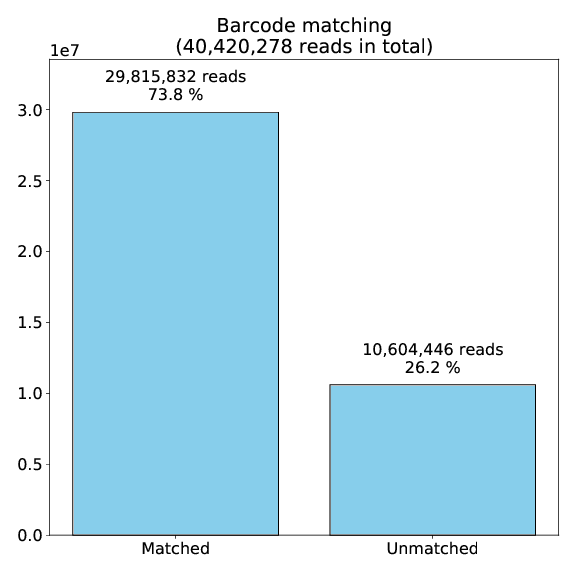

During the barcode matching, we allow mismatches by using the Hamming distance.
The following histogram shows the location of these mismatches in the barcode sequence.
This can highlight mistakes in the read structure specification, or reveal unsucessful ligations during the base call.

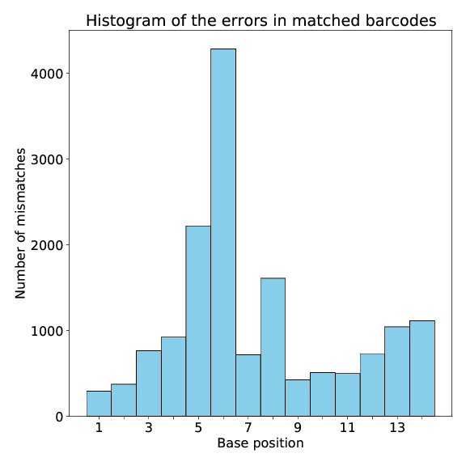

A successful barcode matching can be revealed by comparing it with its counterpart performed with shuffled sequences.
This histogram shows, for each sequencing barcode, the smallest Hamming distance found among the puck barcodes.
In red is the case where we shuffled the puck barcodes sequences, and in blue is where we left the sequences unchaged.

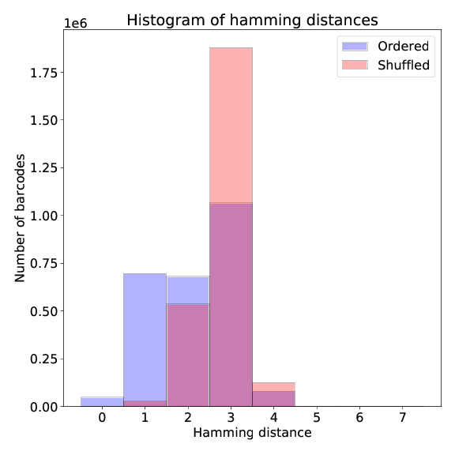

### Sixth step: gene annotation of reads 2 (page 6)

We mapped reads 2 on the genome, now we need to annotate them.
We use [HTSeq](https://htseq.readthedocs.io/en/master/).
HTSeq can be successful or not in annotating a given mapping with a gene.
Here, we plot the reads for which HTSeq was successful.

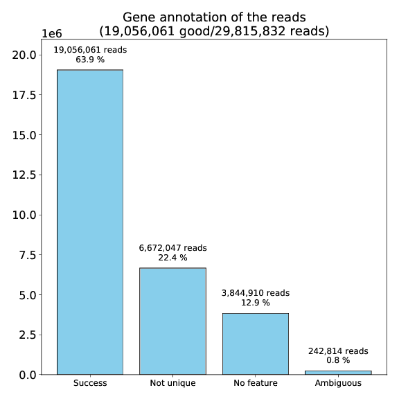

### Seventh step: deduplication (page 7)

The deduplication step is to pick one read when a (barcode,UMI) pair is associated with multiple reads.
In our case we want to have unique (barcode,UMI,gene) tuples in order to produce the count matrix.

The `unique` column is when there is a unique (barcode,UMI,gene) tuple.
In this case, we don't need to do anything and we can just pick this tuple.

The `Included` and `Excluded` correspond to the case where there are multiple (barcode,UMI,gene) tuples, but one of these mappings has an alignmnent score that stands out.
For example:

 * (`ACGTACTTCATGCA`,`TGCAACGT`,GeneA,54)
 * (`ACGTACTTCATGCA`,`TGCAACGT`,GeneB,54)
 * (`ACGTACTTCATGCA`,`TGCAACGT`,GeneB,61)
 * (`ACGTACTTCATGCA`,`TGCAACGT`,GeneC,49)

In this situation, we can include the third (`Included`) and exclude the others (`Excluded`).

The `Unresolved` column is the case where there are multiple (barcode,UMI,gene) tuples, but none of them stands out.
For example:

 * (`ACGTACTTCATGCA`,`TGCAACGT`,GeneA,60)
 * (`ACGTACTTCATGCA`,`TGCAACGT`,GeneB,60)
 * (`ACGTACTTCATGCA`,`TGCAACGT`,GeneC,60)

In this situation we throw everything.

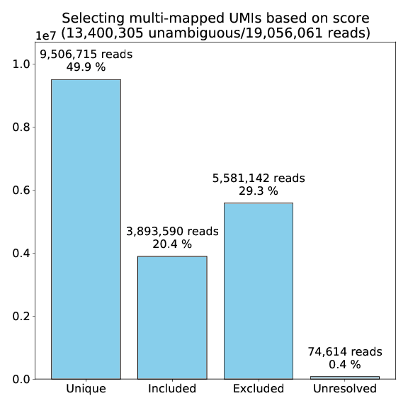

### Checking the read structure specification (pages 8 and 9)

Barcodes and UMIs are generated randomly.
So, we should get ~25 % of all bases at each position.
Therefore, we plot the bases frequencies in order to spot possible mistakes in the read structure specification.


For the barcodes:

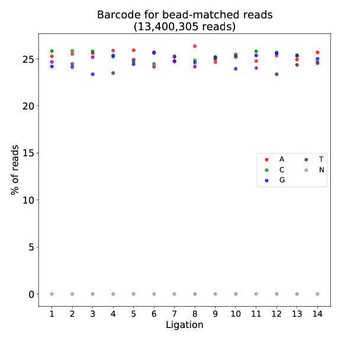

For the UMIs:

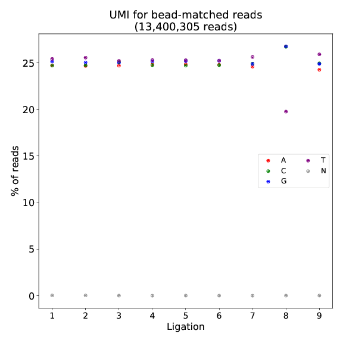

### Library complexity (pages 10, 11, 12 and 16)

There are numerous ways to assess library complexity.
Here are some metrics that we use.

The saturation of the total reads by the TOP 10 % barcodes with the highest number of UMIs (page 10).
<span style="color:green">This plot is probably poorly made in the pipeline. It needs to be recoded.</span>

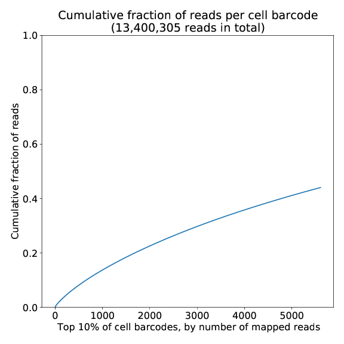

The average number of UMIs per barcode for all the barcodes and for the TOP 10 % barcodes with the highest number of UMIs (page 16).

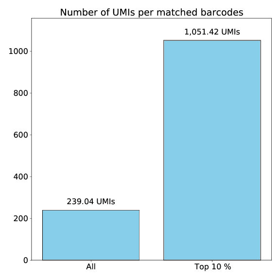

Histogram of the number of UMIs per barcode (page 11).

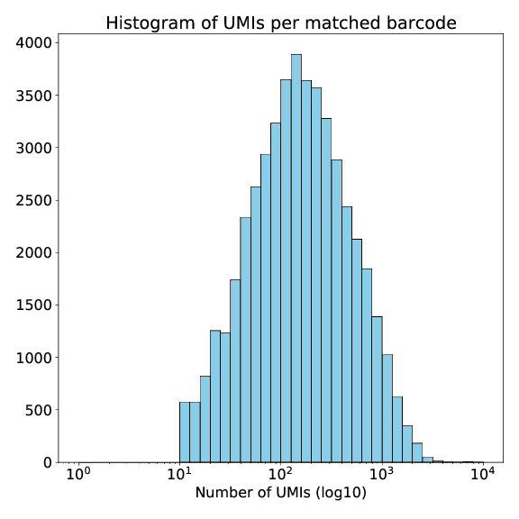

Histogram of the number of genes per barcode (page 11).

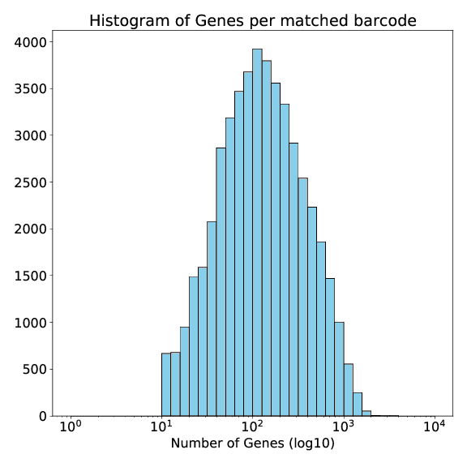

### Looking for histological structures

The best way to see if the pipeline was successul is to plot the number of UMIs per bead on the XY plane and search for known histological structures.

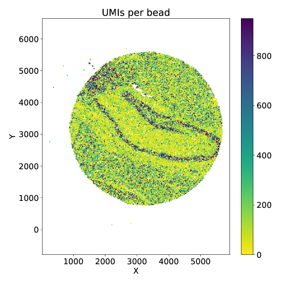

[a](#looking-for-histological-structures)
[c](#second-step-matching-up-primer-page-2)
[b](#test)

## test

third-step:-mapping-read-2-on-the-genome-(page-3)
fourth-step:-filtering-the-barcodes-with-too-few-umis-(page-4)
fifth-step:-barcode-matching-(pages-5,-13,-14,-and-15)
sixth-step:-gene-annotation-of-reads-2-(page-6)
seventh-step:-deduplication-(page-7)
checking-the-read-structure-specification-(pages-8-and-9)
library-complexity-(pages-10,-11,-12-and-16)
